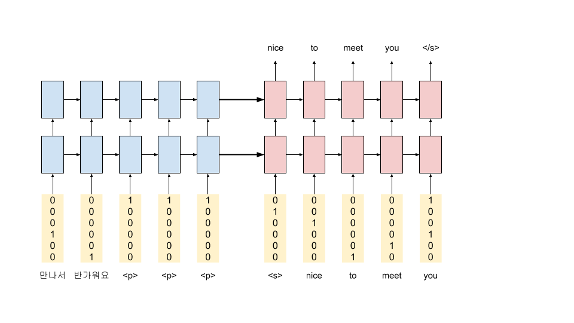
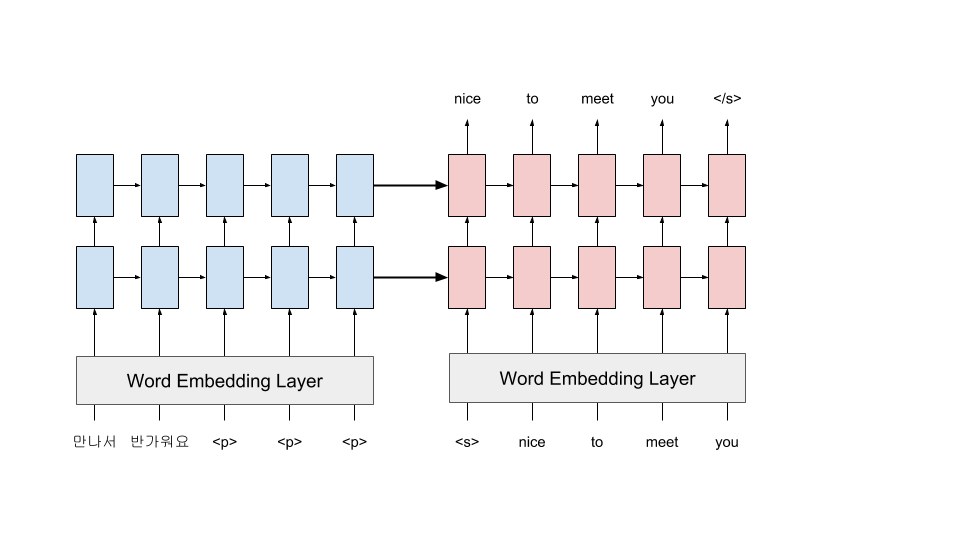
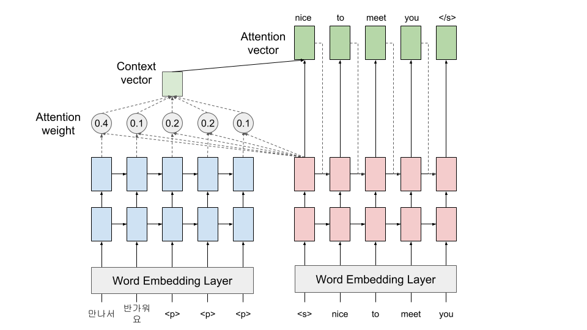
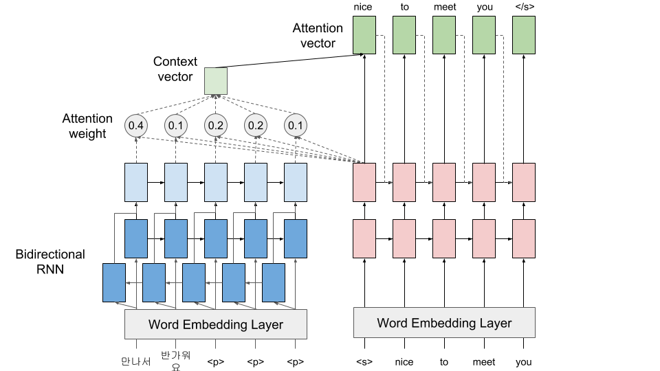

# Tensorflow nmt tutorial
##### A simple implementation of [Tensorflow nmt tutorial](https://github.com/tensorflow/nmt)

## 0. basic_model
basic seq2seq model

## 1. embedding_model
Basic Model + Embedding Layer

## 2. attention_model
Basic Model + Embedding Layer + Attention

## 3. bidirectional_model
Basic Model + Embedding Layer + Attention + Bidirecional Encoder

## 4. beamsearch_model
add beamsearch decoder when inference

